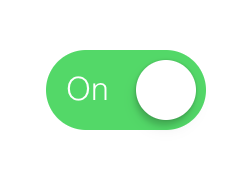
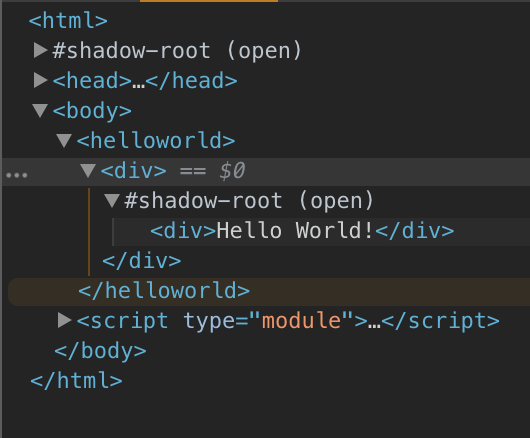

<!-- <p align="center"><p/> -->

<p align="center">
<strong>Fast - Minimal - Easy</strong>
</p>


# Overview

[Zam](http://zamjs.com) 是一个基于组件的微型库（大约3KB）。

Zam对象可以被认为是组件。 这些组件生成一个指定的元素结构，这些元素被安装到DOM。

By confining/compartmentalizing the DOM elements that make up a structure to a Zam component, we create a cleaner coding environment. Through the process of abstraction, a Zam component hides all but the relevant data — in order to reduce complexity and increase efficiency.

通过将构成结构的DOM元素限制/划分为Zam组件，我们创建了一个更清晰的编码环境。 通过抽象的过程，Zam组件隐藏除了相关数据以外的所有数据 - 以降低复杂性并提高效率。


基本上Zam可以建立这个。




By doing this.

```html
<uiswitch>
</uiswitch>
```

```javascript
UISwitch.render();
```

Instead of doing this...

```css
.ui-switch {
  position: relative;
  background-color: #d0d2d3;
  margin: 50px;
  padding: 10px;
  width: 60px;
  height: 20px;
  border: 1px solid clear;
  border-radius: 50px;
  text-align: right;
  transition: background-color 0.1s ease-out;
}

.ui-switch-circle {
  position: absolute;
  left: 5px;
  top: 5px;
  width: 30px;
  height: 30px;
  background-color: white;
  border: 1px solid clear;
  border-radius: 50px;
  box-shadow: 0 0 1px 0 rgba(0, 0, 0, 0.25), 0 4px 11px 0 rgba(0, 0, 0, 0.08),
    -1px 3px 3px 0 rgba(0, 0, 0, 0.14);
  transition: left 0.1s ease-out;
  cursor: pointer;
}

.ui-switch-text {
  position: absolute;
  background-color: initial;
  top: 11px;
  left: 45px;
  transition: left 0.1s ease-out;
}
```

```html
<div class="ui-switch">
    <span class="ui-switch-text">
        Off
    </span>
    <div class="ui-switch-circle">
    </div>
</div>
```

```javascript
var circles = document.querySelectorAll('.ui-switch-circle');
var len = circles.length;
for(var i=0; i<len; i++) {
  circles[i].addEventListener('click', function(e) {
    var circleStyle = e.target.style;
    circleStyle.left === '' ? circleStyle.left = '10px' : circleStyle.left = '';
    var switchStyle = e.target.parentNode.style;
    switchStyle.backgroundColor === '' ? switchStyle.backgroundColor = 'rgb(76, 218, 99)' : switchStyle.backgroundColor = '';
    var textStyle = e.target.parentNode.querySelectorAll('.ui-switch-text')[0].style;
    textStyle.left === '' ? textStyle.left = '45px' : textStyle.left = '';
    var textNode = e.target.parentNode.querySelectorAll('.ui-switch-text')[0];
    textNode.innerHTML === 'Off' ? textNode.innerHTML = 'On' : textNode.innerHTML = 'Off';
  });
}
```

## Import

### Current Stable Build is 10.4

```javascript
inport Zam from "https://cdn.jsdelivr.net/npm/zamjs@10.4.0/zam.min.js"
```

```shell
npm install zamjs@10.4.0
```

## Quickstart

Zam is component based.

<strong>Every Zam object represents and manages a single DOM Element.</strong>

Example - Hello World!

```html
<html>
<head>
</head>
<body>
    <foo>
    </foo>
    <script type="module">
        import Zam from "https://cdn.jsdelivr.net/npm/zamjs@10.4.0/zam.min.js";

        export class Foo extends Zam {
            constructor() {
                super();
                this.append(new Zam('<div>Hello {{someData}}!</div>'), 'hello-text');
                this.append(new Zam('<input type="text" z-bind="someData"></input>'), 'hello-input');
            }
        }
        
        Foo.render();
    </script>
</body>
</html>
```

In this case, instance 'root' manages DOM Element...

```html
<div>Hello World!</div>
```

Now we will expand on the Hello World Example, and utilyze the shadow DOM and introduce shadowRender().

现在我们将展开`Hello World`示例，并且使用shadow DOM并引入shadowRender（）。

```html
<html>
<head>
</head>
<body>
    <foo>
    </foo>
    <script type="module">
        import Zam from "https://cdn.jsdelivr.net/npm/zamjs@10.4.0/zam.min.js";

        export class Root extends Zam {
            constructor() {
                super();
                this.append(new Zam(`<div style="{{helloStyle}}">Hello {{someData}}!</div>`), 'hello-world1');
                this.append(new Zam(`<input z-bind="someData" placeholder="{{placeHolder}}" />`), 'input');
                this['hello-world1'].prop('helloStyle', 'font-size:30px;');
            }
        }
        
        var rootObjects = Root.shadowRender();
        rootObjects[0]['input'].prop('placeHolder', 'Type something...');
        rootObjects[1]['hello-world1'].prop('someData', 'Universe');//err
        rootObjects[0]['hello-world1'].prop('someData', 'Universe');//fix
    </script>
</body>
</html>
```

<p align="center"></p>

## [Examples](http://zamjs.com/examples)

## Instance Properties

* <strong>.e</strong>

  * This is a given component's actual DOMElement.
  * 返回原生的DOMemlment节点对象

  *  Example: someComponent.e.className

## Class Methods

* <strong>SubClass.render()</strong>

  * Example: MyComponent.render(); it renders all <mycomponent> tags.   
    渲染 所有 <mycomponent> 标签.
  
  * Returns: Nothing.
  
* <strong>SubClass.shadowRender()</strong>

  * Example: MyComponent.shadowRender(); it shadowRenders all <mycomponent> tags.   
  渲染虚拟节点
  
  * Returns: Nothing.

* <strong>Zam.on(events, selector, function)</strong>

  * Example: Zam.on('mouseover', 'someSelector', someFunction);
  
  * Returns: Nothing.

* <strong>Zam.off(events, selector, function)</strong>

  * Example: Zam.off('mouseover', 'someSelector', someFunction);

  * Returns: Nothing.

## Instance Methods 内置方法

* <strong>.append(component, key)</strong>

  * Example: someComponent.append(new Zam(`<div>Hello World</div>`), 'hello-world');
  
  * Returns: Component that was appended.

* <strong>.prepend(component, key)</strong>

  * Example: someComponent.prepend(new Zam(`<div>Hello World</div>`), 'hello-world');
  
  * Returns: Component that was prepended.

* <strong>.replace(component, key)</strong>

  * Example: someComponent.replace(new Zam(`<div>Hello World</div>`), 'hello-world');
  
  * Returns: Component that replaced old component.

* <strong>.remove()</strong>

  * Example: someComponent.remove();
  
  * Returns: Nothing.

* <strong>.on(events, function)</strong>

  * Example: someComponent.on('mousedown', someFunction);
  
  * Returns: component that called .on().

* <strong>.off(events, function)</strong>

  * Example: someComponent.off('mousedown', someFunction);
  
  * Returns: component that called .off().
  
* <strong>.customEvent(event)</strong>

  * Example: someComponent.customEvent('some-event');
  
  * Returns: Nothing.
  
* <strong>.dispatchEvent(event)</strong>

  * Example: someComponent.dispatchEvent('some-event');
  
  * Returns: Nothing.